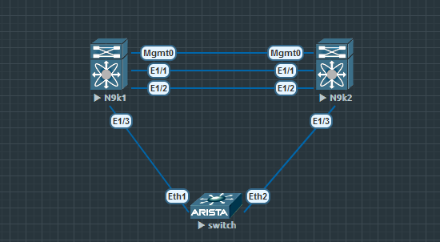

# vpc & eigrp

### Топология


### Конфигурация

Топология и адресация представлена выше на схеме.   
Настройка OSPF на Spine коммутаторах, меняется только router-id в OSPF процессе. Для примера ниже конфигурация коммутатора Spine1
```
hostname Spine1
!
ip routing
!
router ospf 1
   router-id 10.255.254.1
   passive-interface default
   no passive-interface Ethernet1
   no passive-interface Ethernet2
   no passive-interface Ethernet3

!
interface Ethernet1
   description Leaf1
   ip ospf neighbor bfd
   ip ospf network point-to-point
   ip ospf area 0.0.0.0
!
interface Ethernet2
   description Leaf2
   ip ospf neighbor bfd
   ip ospf network point-to-point
   ip ospf area 0.0.0.0
!
interface Ethernet3
   description Leaf3
   ip ospf neighbor bfd
   ip ospf network point-to-point
   ip ospf area 0.0.0.0
!
interface Loopback0
   ip ospf area 0.0.0.0
!
interface Loopback1
   ip ospf area 0.0.0.0 
```
