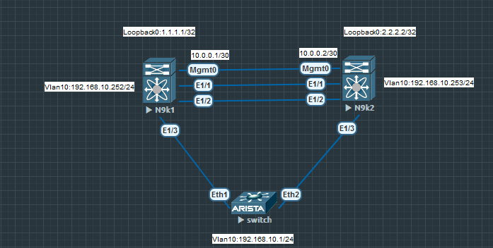

# vpc & eigrp

### Топология


### Конфигурация

Настройка vpc для N9k. Внизу коммутатор Ариста, т.к. память на компьютере не безграничная.    
Влючаем фичи для настройки и начинаем делать vpc peer-link. Он нужен для проверки, что нексусы живые, друг друга видят

```
feature vpc   
feature lacp
!
interface mgmt0 
 ip address 10.0.0.1/30
 no shut 
```
Делаем vpc домен, указываем с каких адресов проверять доступность хостов. priority минимальный будет мастер, в нашем случае N9k1 мастер. Проверяем
```
vpc domain 1
  role priority 20
  peer-keepalive destination 10.0.0.2 source 10.0.0.1 vrf management

N9k1# ping 10.0.0.2 source 10.0.0.1 vrf management
PING 10.0.0.2 (10.0.0.2) from 10.0.0.1: 56 data bytes
64 bytes from 10.0.0.2: icmp_seq=0 ttl=254 time=3.506 ms
64 bytes from 10.0.0.2: icmp_seq=1 ttl=254 time=2.768 ms
64 bytes from 10.0.0.2: icmp_seq=2 ttl=254 time=2.179 ms
64 bytes from 10.0.0.2: icmp_seq=3 ttl=254 time=3.218 ms
64 bytes from 10.0.0.2: icmp_seq=4 ttl=254 time=2.683 ms

--- 10.0.0.2 ping statistics ---
5 packets transmitted, 5 packets received, 0.00% packet loss
round-trip min/avg/max = 2.179/2.87/3.506 ms
```
Делаем сам vpc, что-то наподобие стека или vss линка для 6500
```
interface ethernet 1/1-2
 channel-group 4096 mode active
 no shutdown
 
interface port-channel 4096
 no shutdown 
 switchport
 switchport mode trunk 
 vpc peer-link
```

Создаем тестовый влан и проверяем
```
vlan 10 
 name test 
 
interface eth1/3
 channel-group 10 mode active

interface port-channel 10
 switchport 
 switchport mode trunk 
 switchport trunk allowed vlan 10
 vpc 4096


feature interface-vlan

interface Vlan10
  no shutdown
  ip address 192.168.10.252/24

N9k1# sh vpc
Legend:
                (*) - local vPC is down, forwarding via vPC peer-link

vPC domain id                     : 1
Peer status                       : peer adjacency formed ok
vPC keep-alive status             : peer is alive
Configuration consistency status  : success
Per-vlan consistency status       : success
Type-2 consistency status         : success
vPC role                          : primary
Number of vPCs configured         : 1
Peer Gateway                      : Disabled
Dual-active excluded VLANs        : -
Graceful Consistency Check        : Enabled
Auto-recovery status              : Disabled
Delay-restore status              : Timer is off.(timeout = 30s)
Delay-restore SVI status          : Timer is off.(timeout = 10s)
Operational Layer3 Peer-router    : Disabled
Virtual-peerlink mode             : Disabled

vPC Peer-link status
---------------------------------------------------------------------
id    Port   Status Active vlans
--    ----   ------ -------------------------------------------------
1     Po4096 up     1,10


vPC status
----------------------------------------------------------------------------
Id    Port          Status Consistency Reason                Active vlans
--    ------------  ------ ----------- ------                ---------------
4096  Po10          up     success     success               10


N9k1# ping 192.168.10.1
PING 192.168.10.1 (192.168.10.1): 56 data bytes
64 bytes from 192.168.10.1: icmp_seq=0 ttl=63 time=21.459 ms
64 bytes from 192.168.10.1: icmp_seq=1 ttl=63 time=10.942 ms
64 bytes from 192.168.10.1: icmp_seq=2 ttl=63 time=11.115 ms
64 bytes from 192.168.10.1: icmp_seq=3 ttl=63 time=12.199 ms
64 bytes from 192.168.10.1: icmp_seq=4 ttl=63 time=13.965 ms
```
Для N9k2 аналогичный конфиг
```
feature vpc   
feature lacp 
interface mgmt0
 ip address 10.0.0.2/30
 no shut 
 
vpc domain 1
  role priority 30
  peer-keepalive destination 10.0.0.1 source 10.0.0.2 vrf management
  
  
 interface ethernet 1/1-2
 channel-group 4096 mode active
 no shutdown
 
interface port-channel 4096
 no shutdown 
 switchport
 switchport mode trunk 
 vpc peer-link

vlan 10 
 name test 
 
interface eth1/3
 channel-group 10 mode active

interface port-channel 10
 switchport 
 switchport mode trunk 
 switchport trunk allowed vlan 10
 vpc 4096  
```
Далее простая настройка eigrp. Насколько помню в последних nx-os удалили команду network и надо с интерфейсов включать eigrp. Для анонса сделать Loopback0
N9k1
```
feature eigrp
router eigrp 10

interface Vlan10
  ip router eigrp 10

interface loopback0
  ip address 1.1.1.1/32
  ip router eigrp 10

N9k1# sh ip route eigrp-10
IP Route Table for VRF "default"
'*' denotes best ucast next-hop
'**' denotes best mcast next-hop
'[x/y]' denotes [preference/metric]
'%<string>' in via output denotes VRF <string>

2.2.2.2/32, ubest/mbest: 1/0
    *via 192.168.10.253, Vlan10, [90/130816], 00:35:20, eigrp-10, internal

PING 2.2.2.2 (2.2.2.2) from 1.1.1.1: 56 data bytes
64 bytes from 2.2.2.2: icmp_seq=0 ttl=254 time=7.636 ms
64 bytes from 2.2.2.2: icmp_seq=1 ttl=254 time=7.016 ms
64 bytes from 2.2.2.2: icmp_seq=2 ttl=254 time=6.507 ms
64 bytes from 2.2.2.2: icmp_seq=3 ttl=254 time=6.668 ms
64 bytes from 2.2.2.2: icmp_seq=4 ttl=254 time=6.184 ms

--- 2.2.2.2 ping statistics ---
5 packets transmitted, 5 packets received, 0.00% packet loss
round-trip min/avg/max = 6.184/6.802/7.636 ms
```

Для N9k2
```
feature eigrp

router eigrp 10

interface Vlan10
  ip router eigrp 10

interface loopback0
  ip router eigrp 10
```
